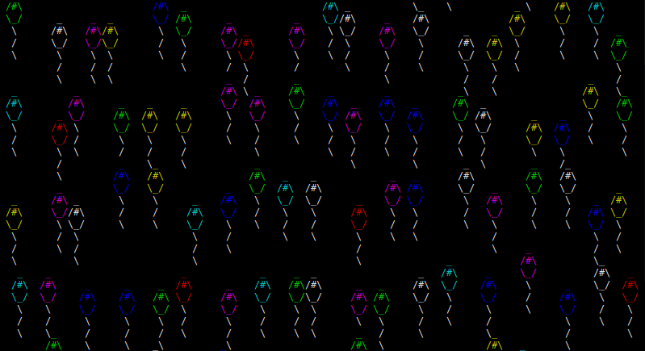

	<h1 align="center">lballoons</h2>
	
A terminal "screensaver" written in C

	
	
	
	   
	

I made this purely to practice C since i have written almost no programs in it.
Inspired by [cmatrix](https://github.com/abishekvashok/cmatrix).

## Controls
| Key           | Description      |
|---------------|------------------|
| CTRL+Q/CTRL+C | Quit the program |

## Dependencies
- ncurses

## Make
Use `make all` to see all the make targets.

### Compiling
Run `make` or `make compile` which will create a binary in the `bin/` folder.

> If you want to change the compiler make uses, set the `C` variable. Example: `make C=gcc`
